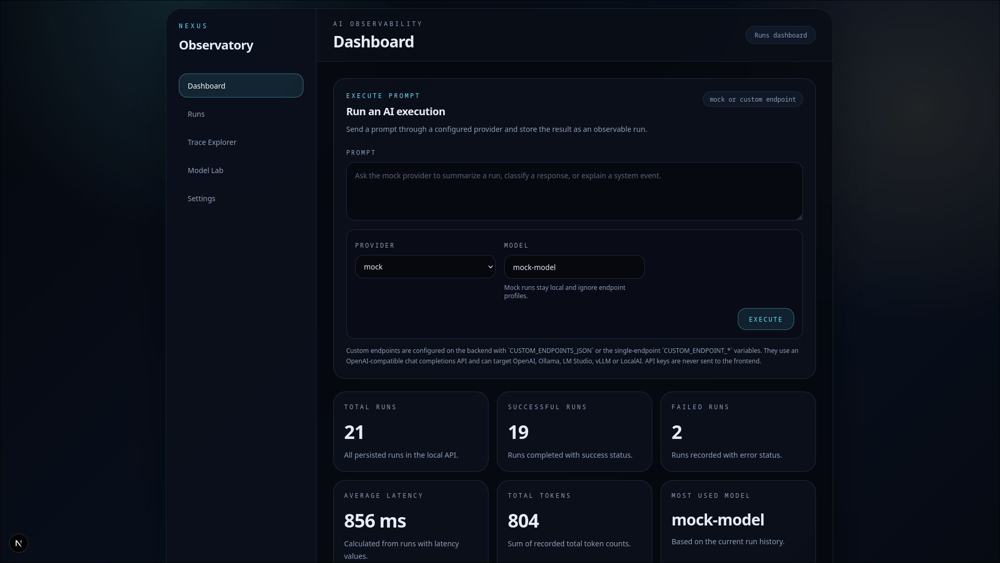
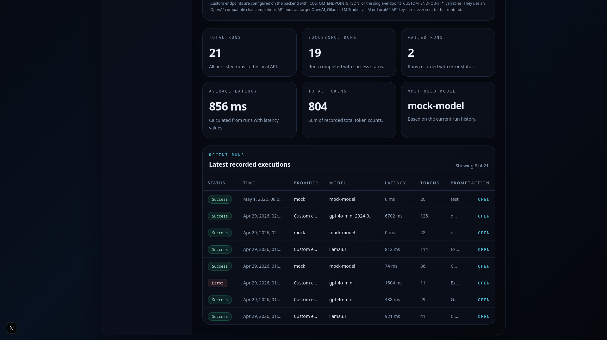
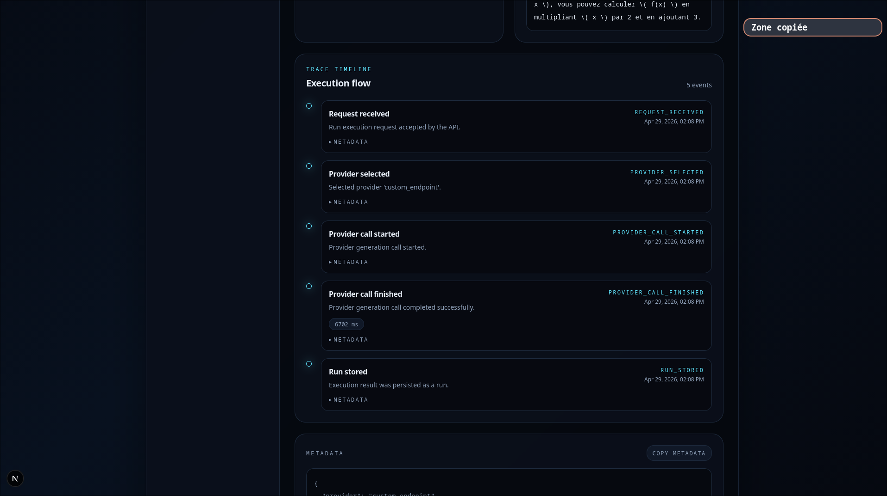
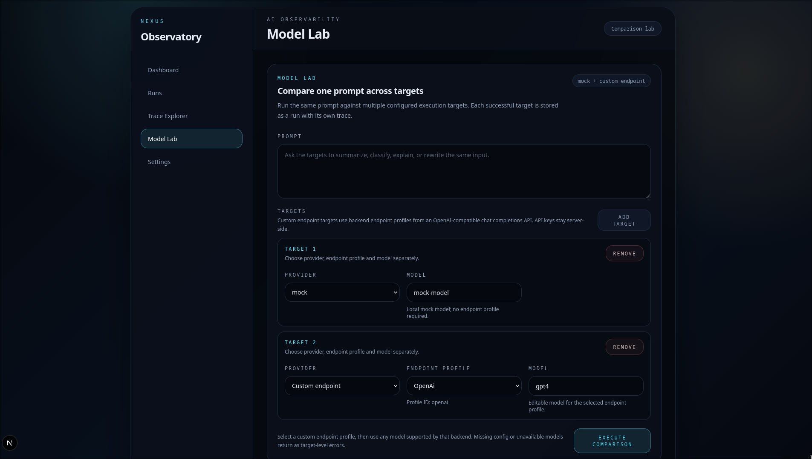
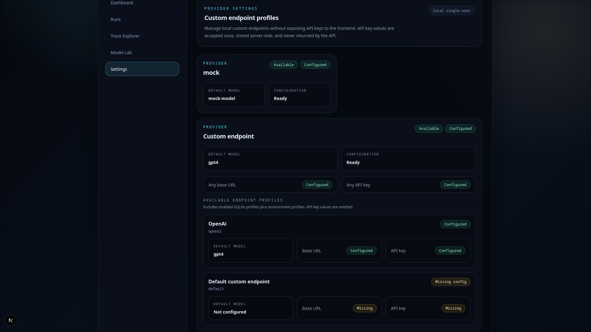
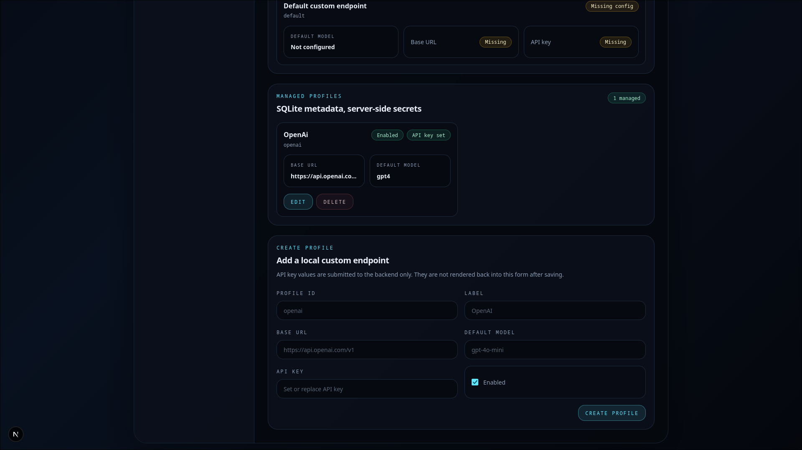

# Nexus Observatory

Nexus Observatory is an AI observability dashboard for monitoring, debugging and comparing LLM runs from a clean local-first interface.

It is designed as a portfolio-grade product: a polished dashboard backed by real API data, local persistence, provider abstraction, run traces and model comparison workflows.

## Product Preview

### Dashboard




### Run Detail & Trace Timeline



### Model Lab



### Provider Settings




## What It Does

Nexus Observatory helps developers inspect AI executions in one place:

- Execute prompts through a local mock provider or one or more custom OpenAI-compatible endpoints.
- Persist AI executions as inspectable runs.
- Track latency, token usage, provider, model, prompt, response and metadata.
- Inspect individual runs with a trace timeline.
- Compare the same prompt across multiple providers/models in Model Lab.
- Check provider readiness from a read-only Settings page.

## Features

- **Dashboard metrics**: total runs, successful runs, failed runs, average latency, total tokens and most used model.
- **Run history**: searchable-style table layout with status, provider, model, latency, tokens and prompt preview.
- **Run detail view**: prompt, response, model/provider metadata, timestamps, token usage and structured metadata.
- **Trace timeline**: execution steps such as request received, provider selected, provider call started, provider call finished and run stored.
- **Prompt execution**: compact dashboard panel for running prompts and storing results.
- **Model Lab**: compare one prompt across multiple targets and custom endpoint profiles with partial success handling.
- **Provider Settings**: read-only provider readiness cards for `mock` and `custom_endpoint`.

## Stack

Frontend:

- Next.js
- TypeScript
- Tailwind CSS

Backend:

- FastAPI
- Python
- SQLite
- Python standard library `sqlite3`
- Uvicorn

Providers:

- `mock`: local/demo provider that requires no credentials.
- `custom_endpoint`: calls OpenAI-compatible chat completions APIs from the backend.

## Repository Structure

```txt
apps/
  api/    FastAPI backend
  web/    Next.js frontend
```

## Local Setup

### Backend

```bash
cd apps/api
python -m venv .venv
source .venv/bin/activate
pip install -r requirements.txt
uvicorn app.main:app --reload --port 8000
```

Health checks:

```bash
curl http://localhost:8000/health
curl http://localhost:8000/ready
```

Expected responses:

```json
{"status":"ok"}
{"status":"ready"}
```

### Frontend

```bash
cd apps/web
npm install
npm run dev
```

Open:

```txt
http://localhost:3000
```

The frontend expects the backend URL in:

```bash
NEXT_PUBLIC_API_BASE_URL=http://localhost:8000
```

## Mock Provider

The mock provider runs locally and does not require backend provider configuration or API keys.

Create a mock run:

```bash
curl -X POST http://localhost:8000/runs/execute \
  -H "Content-Type: application/json" \
  -d '{"prompt":"Explain AI observability simply.","provider":"mock","model":"mock-model"}'
```

The created run appears in the dashboard, the Runs page and the Run Detail page.

## Custom Endpoint Provider

The backend can call any OpenAI-compatible chat completions API through `provider="custom_endpoint"`.

This can target OpenAI, Ollama, LM Studio, vLLM, LocalAI or another service that exposes:

```txt
{CUSTOM_ENDPOINT_BASE_URL}/chat/completions
```

### Multi-endpoint mode

Use `CUSTOM_ENDPOINTS_JSON` when you want Model Lab to compare OpenAI, vLLM, Ollama, LM Studio or other compatible endpoints in the same comparison.

`CUSTOM_ENDPOINTS_JSON` is a JSON array of endpoint profiles:

```json
[
  {
    "id": "openai",
    "label": "OpenAI",
    "base_url": "https://api.openai.com/v1",
    "api_key": "",
    "default_model": "gpt-4o-mini"
  },
  {
    "id": "vllm-local",
    "label": "Local vLLM",
    "base_url": "http://localhost:8001/v1",
    "api_key": "",
    "default_model": "llama3.1"
  },
  {
    "id": "ollama",
    "label": "Ollama",
    "base_url": "http://localhost:11434/v1",
    "api_key": "",
    "default_model": "llama3.1"
  }
]
```

Shell example:

```bash
export CUSTOM_ENDPOINTS_JSON='[{"id":"openai","label":"OpenAI","base_url":"https://api.openai.com/v1","api_key":"","default_model":"gpt-4o-mini"},{"id":"vllm-local","label":"Local vLLM","base_url":"http://localhost:8001/v1","api_key":"","default_model":"llama3.1"},{"id":"ollama","label":"Ollama","base_url":"http://localhost:11434/v1","api_key":"","default_model":"llama3.1"}]'
```

For each profile, `base_url` should usually end at `/v1` when the provider uses OpenAI-style paths.

### Single-endpoint mode

If `CUSTOM_ENDPOINTS_JSON` is empty, the backend falls back to one default endpoint profile from the existing `CUSTOM_ENDPOINT_*` variables.

OpenAI example:

```bash
export CUSTOM_ENDPOINT_BASE_URL="https://api.openai.com/v1"
export CUSTOM_ENDPOINT_API_KEY=""
export CUSTOM_ENDPOINT_DEFAULT_MODEL="gpt-4o-mini"
```

Ollama example:

```bash
export CUSTOM_ENDPOINT_BASE_URL="http://localhost:11434/v1"
export CUSTOM_ENDPOINT_API_KEY=""
export CUSTOM_ENDPOINT_DEFAULT_MODEL="llama3.1"
```

`CUSTOM_ENDPOINT_BASE_URL` should usually end at `/v1` when the provider uses OpenAI-style paths.

For compatibility with older local setups, `OPENAI_COMPATIBLE_BASE_URL`, `OPENAI_COMPATIBLE_API_KEY` and `OPENAI_COMPATIBLE_DEFAULT_MODEL` are still read as fallbacks when the `CUSTOM_ENDPOINT_*` variables are not set.

API keys stay backend-side. Environment profiles read keys from environment variables; Settings-managed profiles store metadata in SQLite and keep only a server-side secret reference when secret storage is enabled. Raw keys are never exposed to the Next.js frontend.

The frontend only selects the provider/model and sends the prompt to the backend.

### Settings-managed profiles

Custom endpoint profiles can also be managed from the Settings page.

Profile metadata is stored locally in SQLite. API keys are handled server-side and are never returned to the frontend.

Secret storage defaults to `auto`: the backend tries OS keyring first, then uses an encrypted local fallback under the backend data directory when keyring is unavailable.

An explicit insecure fallback exists only as an advanced local development last resort:

```bash
NEXUS_SECRET_STORE=insecure-development
NEXUS_ALLOW_INSECURE_LOCAL_SECRETS=true
```

The insecure fallback is for local development only and should not be used with real credentials.

Environment-based `CUSTOM_ENDPOINTS_JSON` and `CUSTOM_ENDPOINT_*` configuration still work as bootstrap/fallback config.

## Provider Status

The Settings page calls:

```txt
GET /providers/status
```

It reports whether each provider is available and configured. For custom endpoints, it returns endpoint profile IDs, labels, default models and configuration booleans; it never returns API key values.

## Demo Flow

1. Start the backend.
2. Start the frontend.
3. Execute a mock prompt from the dashboard.
4. Inspect the created run in the Runs page.
5. View the trace timeline on the Run Detail page.
6. Compare mock and one or more custom endpoint profiles in Model Lab.
7. Check provider status in Settings.

## Demo Data

Seed realistic local demo runs:

```bash
cd apps/api
source .venv/bin/activate
python -m app.scripts.seed_demo_data
```

The script creates successful and failed runs across `mock` and `custom_endpoint` providers, including trace events for Run Detail pages.

It is safe to run multiple times. Existing rows seeded by this script are replaced, and user-created non-demo runs are preserved.

## Validation

Backend:

```bash
cd apps/api
source .venv/bin/activate
python -m compileall app tests
python -m unittest discover -s tests
```

Frontend:

```bash
cd apps/web
npm run build
```
